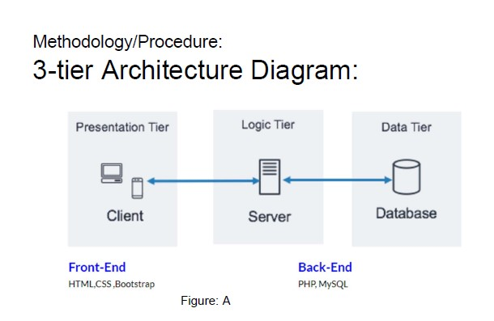

# A-simple-E-commerce-website
CSE 299 - Junior Design Project  

Abstract:

This is a project on a simple E-commerce website. As E-commerce is a growing
concept in Bangladesh and already has so many websites, the goal of this project was
to sort out the best features amongst them and make a unique E-commerce website
which would be pretty simple to use.The project would help us find out what our online
customers really look for. In order to keep things simple,technologies like
php,mysql,javascript,CSS,Bootstrap were used. For the architecture,3 tier architecture
was used where the frontend and backend was connected using a logic tier. The main
features in the website were, search functionality, product details, subcategorized
products, discounted price, easy order placing, user authentication etc. There were
mixed findings on the project. The website could be used by small business enthusiasts
to sell their products. There were also chances to develop the project.

