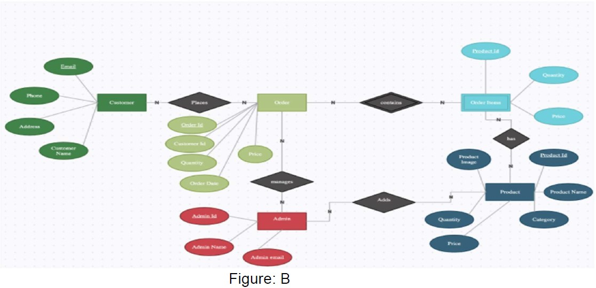

# A-simple-E-commerce-website
CSE 299 - Junior Design Project  

Abstract:

This is a project on a simple E-commerce website. As E-commerce is a growing
concept in Bangladesh and already has so many websites, the goal of this project was
to sort out the best features amongst them and make a unique E-commerce website
which would be pretty simple to use.The project would help us find out what our online
customers really look for. In order to keep things simple,technologies like
php,mysql,javascript,CSS,Bootstrap were used. For the architecture,3 tier architecture
was used where the frontend and backend was connected using a logic tier. The main
features in the website were, search functionality, product details, subcategorized
products, discounted price, easy order placing, user authentication etc. There were
mixed findings on the project. The website could be used by small business enthusiasts
to sell their products. There were also chances to develop the project.

<!--
Methodology:

-->
## List of Existing Features
1.	Multi-user login, Logout, and Registration.
2.	User Profile Dashboard: Create and Update.
3.	Announcement: Create (Only Trainmaster) and view (everyone) announcements.
4.	Admin Pannel (Update, Order System, Monitor, Change User permission.
5.	Online Payment: Confirm payment to get the ticket.
6.	Cancel order: Cancel and get refunded for the product purchased.
7.	Order History: View (Both General User and Admin Panel) logs of product purchase history or download them.
8.	Digital Order Tracking: Each order  comes with an order tracking facility
9.	Contact Us: Generates an email from the user’s feedback and sends it to an Admin.
10.	FAQ: Shows the question and answers to the most Frequently Asked Questions. Sends email through the form.
11.	Product Update: Let the admin add new products and update the existing one
12.	Ratings and reviews: Users can give ratings from 1 to 5 stars. As well as include reviews about their purchased products

## Screenshots
1. Homepage of the Website

2. Sign in/Sign up Page:

3. Search Functionality: If any product was searched [Figure 2] inside the search bar
then the results were displayed (including the normal price and the discounted price) as
below

<!--
ER-diagram: 

-->

Full details can be found inside the Project Report Folder

For Any queries or to get access the full source code Feel Free to Email me : mubassir.jahan01@gmail.com
